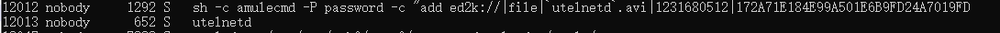

# R6400v2 amule CMD Injection
Vulnerability for D-Link Router

Product: Netgear R6400v2 (https://www.netgear.com/support/product/R6400v2.aspx)

The Latest Firmware Version 1.0.4.84_10.0.58  (http://www.downloads.netgear.com/files/GDC/R6400v2/R6400v2-V1.0.4.84_10.0.58.zip)

The Class of Vulnerability: Command Injection

Author: leonW7 of SJTU

Vulnerability description
-------------------------
An issue was discovered on Netgear R6400v2 devices with firmware through 1.0.4.84_10.0.58. A command Injection vulnerability allows attackers to execute arbitrary OS commands via shell metacharacters in a crafted POST request. This occurs when the amule function calls the system function with an untrusted input parameter named "ed_url". 

The affected executable is /usr/sbin/httpd that operates web service of router, and the details of the bug fuction are as below:


The v5 parameter of sprintf function is a string var which is from a POST parameter named "ed_url", and this parameter will be formed as below:

```
ed2k://|file|`utelnetd`.avi|1231680512|172A71E184E99A501E6B9FD24A7019FD|
```

Then, this function call system function to execute the command "utelnetd":



Finally, the attacker get the telnet shell.
